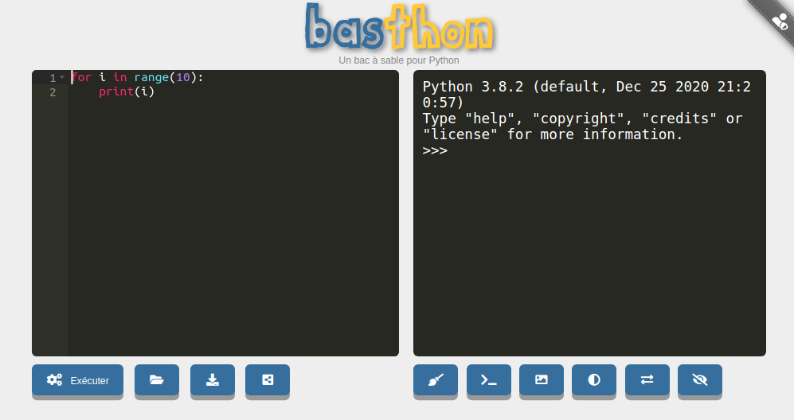
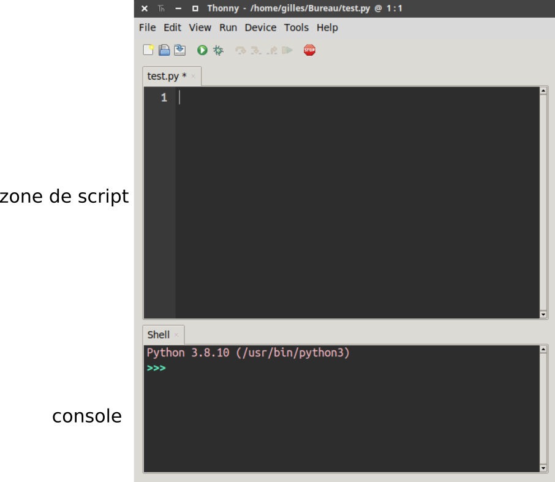

# Travailler en Python : aspects pratiques

## 1. Python, c'est quoi ?

C'est un langage de programmation inventé en 1991 par [Guido Van Rossum](https://fr.wikipedia.org/wiki/Guido_van_Rossum).

Ce langage est un des langages les plus utilisés actuellement (avec le C, le Java, le Javascript ...), notamment dans le monde scientifique. Il est aussi parfaitement adapté à la découverte de la programmation, de par sa clarté et sa concision. (il a aussi bien sûr beaucoup de défauts !)

## 2. Quel environnement de travail ?
Comme tous les langages de programmation, il n'existe pas **un** logiciel permettant de coder en Python, mais un très (très) grand nombre de logiciels différents, qu'on regroupe sous le nom d'IDE (interfaces de développement)

Parmi eux, je conseille Thonny :

### 2.1  Pour installer sur son pc perso : Thonny

{: .center}


1. Rendez vous sur la page [https://thonny.org/](https://thonny.org/)

2. Téléchargez et installez la version qui correspond à votre système d'exploitation (Windows, Mac, Linux).

### 2.2 Directement en ligne : Basthon

Rendez-vous sur la page [https://console.basthon.fr/](https://console.basthon.fr/)



### 2.3 Directement sur ce site !

Écrivez dans la fenêtre ci-dessous le code ```print("Hello World !")``` puis cliquez sur le triangle noir.

{{ IDEv() }}


## 3. Script ou console ???

Thonny, comme la grande majorité des IDE Python, est composé de deux zones distinctes :

- la zone de script
- la console

{: .center width=50%}

La zone de script est **asynchrone**. Il ne se passera rien tant que vous n'aurez pas exécuté le script (par F5 par exemple).
C'est donc l'endroit où on va rédiger son programme.

La **console** est synchrone : elle répond dès que vous appuyez sur la touche Entrée. Elle sert donc aux petits tests rapides, ou bien tests post-exécution d'un code.

!!! note "Utilisation classique du couple script / console"
    1. On écrit son code dans la zone de script
    2. On l'exécute.
    3. On interroge la console pour connaître l'état des variables, pour utiliser les fonctions construites dans le script.

Pour les extraits de code présents sur ce site :

- tout le code qui est précédé d'une numérotation de ligne est à écrire en zone de script.

Exemple :
```python linenums='1'
def accueil(n):
   for k in range(n):
       print("bonjour") 
```

- tout le code qui est précédé ```>>>``` est à taper en console.

Exemple :
```python
>>> accueil(5)
```